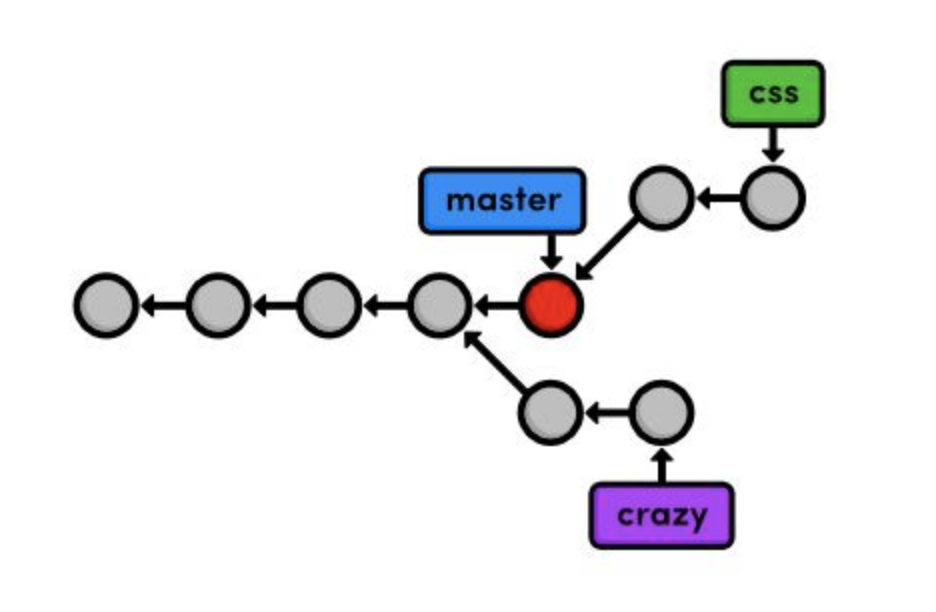
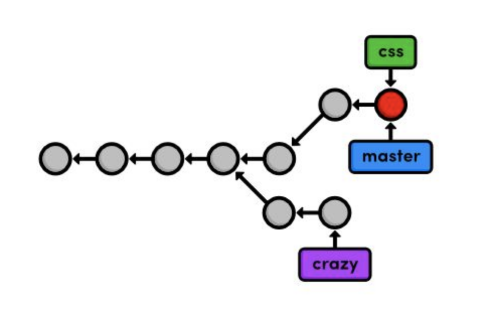
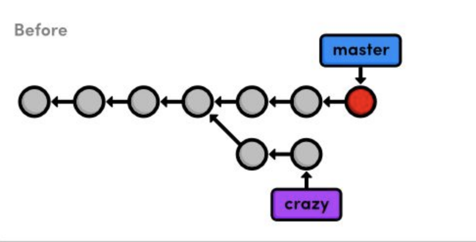
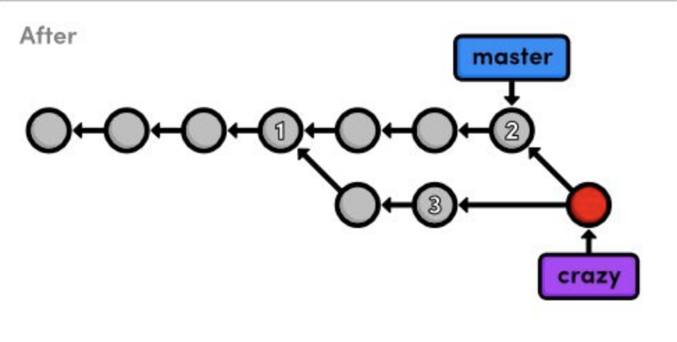
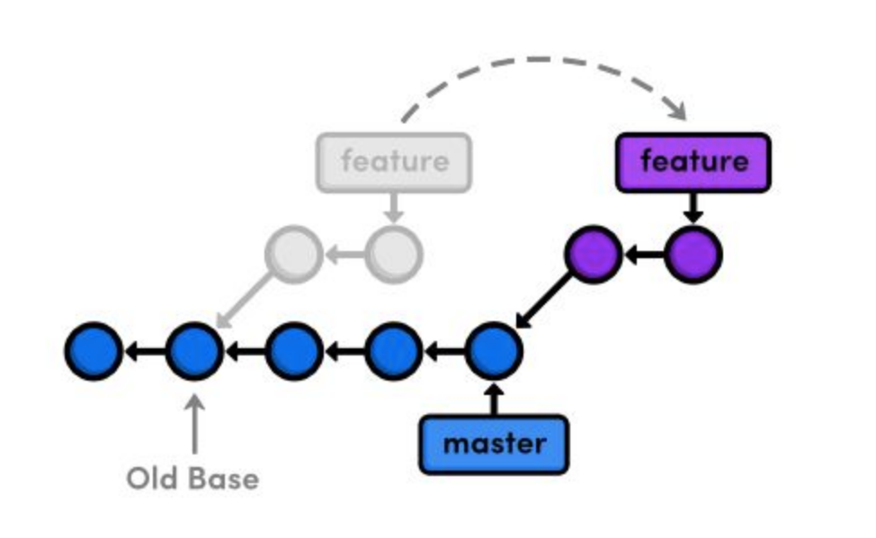

## Quick reference


### 1. Chapter - The Basics

```
git log --online
```

Condenses each commit information of `git log` to a single line.

```
git log --oneline <file-name>
```

Displays the history of `<file-name>` (all the commits after `<file-name>` is added to git).

### 2. Chapter - Undoing Changes

```
git tag -a <tag-name> -m "<description>"
```

Create an annotated tag pointing to the most recent commit. (`git checkout <tag-name>`).

```
git reset --hard
```

Reset tracked files (both working directory and staging area changes) to the most recent commit.

```
git clean -f
```

Remove untracked files.

### 3. Chapter - Branches I

The HEAD is Git's internal way of indicating the snapshot that is currently checkout out. The HEAD normally resides on 
the tip of the development branch.

```
git branch <branch-name>
```

Creates a new branch using the current working directory as its base.

```
git merge <branch-name>
```

Merge a branch into the checked-out branch.

##### Fast-forward merge



```
git merge css
```



Instead of re-creating the commits in css and adding them to the history of `master`, Git reuses the existing snapshot 
and simply moves the tip of `master` to match the tip of `css`. This kind of merge is called fast-forward merge, since 
Git is "fast-forwarding" through the new commits in the `css` branch.

### 4. Chapter - Branches II

Temporary branches are called **topic** branches because they exist to develop a certain topic, then they are deleted.

Longer-running type of topic branches are called a **feature** branch as it was created with the intention of 
developing a specific feature.

**Hotfix** branches are used to quickly patch a production release.

Usually permanent master branch is used as a foundation for all these temporary branches. In addition to master, many 
programmers add a second permanent branch called develop. This lets them use master to record really stable snapshots 
(e.g., public releases) and use develop as more of a preparation area for master.

```
git commit -a -m "<message>"
```

Stage all tracked files and commit the snapshot using the specified message.

p.s. Git uses the tip of a branch to represent the entire branch. That is to say, a branch is actually a pointer to a 
single commit, not a container for a series of commits.

##### 3-way merge



```
git merge master
```



A 3-way merge occurs when you try to merge two branches whose history has diverged. It creates an extra merge commit 
to function as a link between the two branches. As a result, it has two parent commits.

### 5. Chapter - Rebasing

```
git checkout feature
git rebase master
```



Instead of joining the branches with a merge commit, rebasing integrates the feature branch by building on top of 
master. Rebasing enables fast-forward merges by moving a branch to the tip of another branch, resulting in a completely 
linear history.

```
git rebase <new-base>
```

Move the current branch's commits to the tip of `<new-base>`, which can be either a branch name or a commit ID.

```
git rebase -i <new-base>
```

Perform an interactive rebase and select actions for each commit.

```
git merge --no-ff <branch-name>
```

Forces a merge commit even if Git could do a fast-forward merge.

### 6. Chapter - Rewriting History

```
git reset --hard HEAD~<n>
```

The `git reset` command moves the checked out snapshot to a new commit, and the `HEAD~1` parameter tells it to reset to 
the commit that occurs immediately before the current HEAD. Likewise HEAD~2 would refer to second commit before HEAD.

The `--hard HEAD~1` tells Git to make make the working directory look exactly like the most recent commit, giving us 
the intended effect of removing uncommmited changes.

The commit that we removed from the branch is not a **dangling commit**. Dangling commits are those that cannot be 
reached from any branch and are thus in danger of being lost forever.

```
git reflog
```

The reflog is a chronological listing of our history, without regard for the repositry's branch structure. This lets us 
find dangling commits that would otherwise be lost from the project history.

```
git log <since>..<until>
```

Display the commits reachable from `<until>` but not from `<since>`. These parameters can be either commit ID's or 
branch names.

```
git log --stat
```

Include extra information about altered files in the log output.
